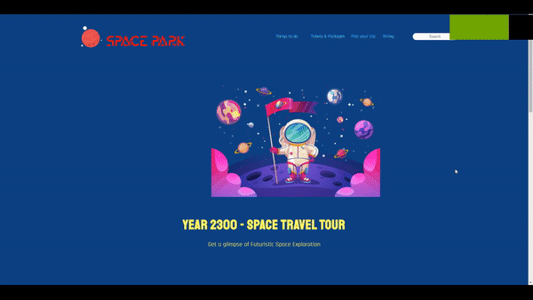

# Space Park

### Stack/Technologies used:-

**HTML**

**JavaScript**

**CSS**

  

"Space Park" is a group project submission for my Web Development module, as part of my BSc Computer Science degree.

Space Park was created with full collaboration and team input for every plan, change or addition made and we worked in an Agile workflow.

The core concept was that of a theme park and the types of services they provided - for example the tickets section, the dining/shops and the interactive map!
 
A lot of initial planning and research went into existing theme parks today and the services they provided, as well as on their chosen implementation and designs for their respective sites.

This was an immense learning oppertunity as we had to collaborate with students on an international scale, so factors such as timezones, availability, language barriers and the like, had to be planned for to ensure all team members are satisfied, have their needs/commitments supported and so we can work in unison with all members being 'in the loop' at all stages.

Thank you for visiting!

 

## Getting Started

These instructions will get you a copy of the project up and running on your local machine for development and testing purposes. See deployment for notes on how to deploy the project on a live system.

### Installing

A step by step series of examples that tell you how to get a development env running
 
 
**1 - Under the repository name, right-hand side, click the 'Code' button.**
 

**2 - In the following pop-up box, depending on personal prefrences, there are a number of methods for you to get up and running - whether that be from downloading the zip itself, or using https / github CLI.**
 

#### Demo

